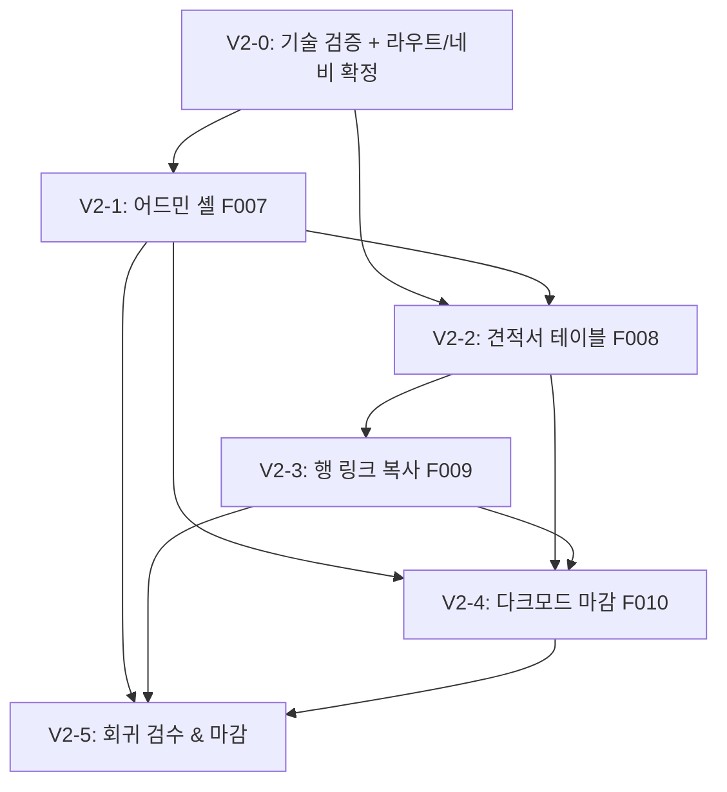

# 프로젝트 로드맵 v2: 견적서 관리 어드민 고도화

> 본 로드맵은 MVP(`docs/ROADMAP_v1.md`) 완료 이후의 **고도화(v2)** 실행 문서입니다.
> 공개 견적서 뷰어(`/`, `/quotes/[id]`)는 유지하되, **운영자 전용 어드민 레이아웃**을 신설하여
> 견적서를 데이터 밀도 높은 테이블로 관리하고, 행 단위 링크 공유와 전 화면 다크모드를 마감합니다.
> MVP에서 이미 구현된 기능은 재구현하지 않고 **통합·고도화·마감** 관점으로만 다룹니다.

---

## 개요

| 항목 | 내용 |
|------|------|
| **비전** | MVP의 공개 뷰어 위에 "운영자 작업대"를 얹는다 — 견적서 발행 1인 운영자가 목록을 빠르게 훑고, 정렬·검색·필터로 원하는 건을 찾고, 클릭 한 번에 클라이언트 공유 링크를 복사 |
| **핵심 목표** | (1) 어드민 셸(사이드바+헤더) 안에서 견적서 테이블 관리 (2) 테이블 행 단위 링크 복사 (3) 전 화면 다크모드 완성 + 인쇄는 라이트 강제 |
| **사용자** | **운영자**(어드민 `/admin/*` 사용) / 클라이언트(기존 공개 `/`·`/quotes/[id]` 그대로) |
| **성공 지표** | `/admin/quotes` 테이블에서 정렬·검색·페이지네이션 동작 · 행 링크 복사 시 토스트+정확한 절대 URL · 다크모드 토글이 목록/상세/어드민 전 화면 일관 적용 · 인쇄 PDF는 다크모드와 무관하게 라이트로 출력 · 어드민/공개 진입점이 `mainNav` 단일 소스로 일관 |

### 기능 ID 매핑 (v1에서 연속)

| ID | 기능 | 주 담당 Phase |
|----|------|--------------|
| F007 | 어드민 레이아웃(사이드바+헤더 셸 + `(admin)` 라우트 그룹) | Phase V2-1 |
| F008 | 어드민 견적서 목록 테이블(@tanstack/react-table) — 정렬/검색/페이지네이션 | Phase V2-2 |
| F009 | 테이블 행 단위 공유 링크 복사(F005 재배치/강화) | Phase V2-3 |
| F010 | 다크모드 마감(어드민 통합 + 전 화면 검수 + 인쇄 라이트 강제) | Phase V2-4 |

> MVP 기능(F001~F006)은 완료 상태이며 본 문서에서 재구현하지 않는다.

---

## 가정 및 제약사항

- **MVP 완료 코드베이스 위에서 작업**: Next.js 16 App Router · React 19.2 · TS strict · Tailwind v4 · shadcn/ui(radix-nova/neutral) · `@notionhq/client` v5. 경로 별칭 `@/*` → `src/*`.
- **실측한 기존 자산** (재구현 금지, 재사용·재배치 대상):
  - 데이터 레이어: `src/lib/notion.ts`(`getQuotes`/`getQuote` 실구현 완료), `src/lib/types.ts`(`Quote`/`QuoteItem`/`QuoteStatus`/`quoteStatusLabel`), 금액 포맷터.
  - 라우트: `src/app/page.tsx`(공개 목록 `/`), `src/app/quotes/[id]/page.tsx`(공개 상세), `src/app/error.tsx`, `src/app/not-found.tsx`.
  - 컴포넌트: `quotes/quote-list-client.tsx`(**단순 배열 필터** 기반 카드 목록 — TanStack Table 미사용), `quotes/quote-card.tsx`, `quotes/quote-share-button.tsx`(**F005, `quoteId` props로 절대 URL 복사 + sonner 토스트, 재사용 가능**), `quotes/quote-detail.tsx`, `quotes/quote-print-frame.tsx`, `quotes/status-badge.tsx`.
  - 공용/레이아웃: `common/theme-toggle.tsx`(**라이트/다크/시스템 토글 완성, 동작 확인됨**), `common/empty-state.tsx`, `layout/page-header.tsx`.
  - 프로바이더: `providers/providers.tsx`에 `ThemeProvider`(`attribute="class"`, `defaultTheme="system"`, `enableSystem`) + `TooltipProvider` + `Toaster` 통합 완료. `app/layout.tsx`의 `<html suppressHydrationWarning>` 존재(next-themes용 — 제거 금지).
  - 설정: `src/config/site.ts` — `siteConfig`(name/description/url), `mainNav`(현재 "견적서 목록 → `/`" **1개 항목만** 존재).
  - UI 프리미티브: `badge button card dialog dropdown-menu separator sonner table tooltip` 존재.
  - 테스트: **vitest 설치됨**(`npm run test` = `vitest run`, `npm run test:watch`). 단위 테스트 인프라 가동 가능.
- **결정적 사실 — 어드민 셸은 현재 존재하지 않는다**:
  - **`(dashboard)`/`(admin)` 라우트 그룹 없음.** 현재 라우트는 `/`, `/quotes/[id]`뿐.
  - **사이드바 컴포넌트 없음.** `src/components/layout/`에는 `page-header.tsx`만 존재.
  - 즉 "어드민 레이아웃"은 기존 셸을 *재사용*하는 것이 아니라 **새로 구축**해야 한다. (스타터킷 정리 과정에서 대시보드 셸 자산이 제거된 상태.)
- **`@tanstack/react-table` 미설치** → Phase V2-2에서 `npm i @tanstack/react-table`로 추가 필요. 이 시점부터 React Compiler 함정이 **실제로 활성화**된다.
- **React Compiler 함정(반드시 준수)**: `reactCompiler: true` 환경에서 `useReactTable`을 쓰는 클라이언트 컴포넌트는 **최상단에 `"use no memo";` 지시어 필수**. 누락 시 런타임 오류. (MVP 목록은 단순 filter라 무관했으나, v2 테이블 도입으로 처음 직면.)
- **RSC 기본**: 노션 fetch(`getQuotes`)는 어드민 페이지(RSC)에서 수행하고, 결과 `Quote[]`만 클라이언트 테이블 컴포넌트에 props로 전달. 정렬/검색/페이지네이션·행 복사·테마 토글 등 상호작용만 `"use client"`.
- **단일 소스 원칙**: 네비게이션은 `src/config/site.ts`의 `mainNav`(어드민 항목 추가는 여기에만), 사이트 메타는 `siteConfig`, 전역 프로바이더는 `providers/providers.tsx` 한 곳에만. **새 UI 프리미티브는 `npx shadcn@latest add <component>`로 추가**, `ui/` 직접 작성 지양.
- **컴포넌트 계층 준수**: `ui`(shadcn) → `providers` → `layout`(셸/사이드바/헤더) → `common`(재사용 위젯) → `dashboard`/`quotes`(기능별).
- **공개 뷰어 회귀 금지**: 클라이언트가 받는 공유 링크 대상은 기존 공개 `/quotes/[id]`이며, 어드민 도입이 공개 경로의 동작·URL을 바꾸지 않는다.
- **어드민 접근 = 인증 없는 공개(확정)**: 어드민 화면(`/admin/*`)도 MVP의 공개 구조를 유지하여 **누구나 접근 가능**하다. 운영자 인증/접근 제어(로그인 페이지, 미들웨어 가드, 세션)는 **v2에서도 Out of Scope로 확정**. 따라서 어드민 라우트에 인증 미들웨어·로그인 페이지·세션 처리를 두지 않는다. (의사결정 완료 — 아래 "미해결 질문" 1번 참조.)
- **테스트 환경**: 로컬 `npm run dev` 기동 후 Playwright MCP(`mcp__playwright__browser_*`)가 `http://localhost:3000`에 접속해 검증. 단위 테스트는 vitest.

---

## 마일스톤 개요

| Phase | 목표 | 예상 규모 | 핵심 산출물 |
|-------|------|----------|------------|
| **Phase V2-0** | 착수 전 기술 검증 | S | TanStack Table + React Compiler 호환 스모크, 라우트 그룹/네비 설계 확정 |
| **Phase V2-1** | 어드민 셸 신설 (F007) | M~L | `(admin)` 라우트 그룹 + 사이드바/헤더 레이아웃 + `mainNav` 확장 |
| **Phase V2-2** | 어드민 견적서 테이블 (F008) | L | `@tanstack/react-table` 도입 + 정렬/검색/페이지네이션 + `"use no memo"` |
| **Phase V2-3** | 행 단위 링크 복사 (F009) | S~M | 테이블 행 액션 메뉴에 F005 재배치/강화 |
| **Phase V2-4** | 다크모드 마감 (F010) | M | 어드민 헤더 토글 통합 + 전 화면 검수 + 인쇄 라이트 강제 |
| **Phase V2-5** | 회귀 검수 & 마감 | S~M | 빌드/린트/단위/E2E 전수 통과 + 공개 뷰어 무회귀 확인 |

> 규모 표기: S(반나절) / M(1~2일) / L(3일+). 우선순위: P0(필수) / P1(중요) / P2(선택).

---

## 테스트 전략 (모든 Phase 공통 — 필수)

> v1과 동일 원칙. 고도화 작업에도 "테스트 없이 완료 없음"을 그대로 적용한다.

- **비즈니스 로직은 "테스트 가능한 형태"로 구현**한다. 입력/출력/엣지 케이스(빈 목록·null 필드·검색 무매칭·페이지 경계)를 명확히 정의하고, 외부 의존성과 분리해 검증이 쉽도록 함수를 쪼갠다. v2에서 핵심 순수 로직은 **정렬 comparator**, **검색 필터 predicate**, **페이지네이션 계산**, **공유 URL 생성기**다.
- **각 구현 작업에는 짝이 되는 테스트 작업을 함께 둔다.** 구현 작업 DoD에 "테스트 작성·통과"를 포함하며, **테스트 없이는 완료로 간주하지 않는다.**
- **구현 후 반드시 테스트를 수행**한다. 각 Phase 말미에 **검증 게이트**(테스트 전부 통과 시에만 다음 Phase 진행)를 둔다.
- **테스트 분류**:
  - **단위 테스트(vitest)** — 순수 로직(정렬/검색/페이지네이션 헬퍼, 공유 URL 생성). 외부 노션 API는 고정 표본(fixture) `Quote[]`로 대체. UI 컴포넌트 의존 없이 함수만 검증하도록 테이블 로직을 헬퍼로 분리하는 것을 권장.
  - **E2E·UI·통합 테스트(Playwright MCP `mcp__playwright__browser_*`)** — 실제 브라우저에서 어드민 셸 렌더링, 테이블 정렬/검색/페이지 이동, 행 링크 복사 토스트·클립보드 값, 다크모드 토글 전 화면 적용, 인쇄 라이트 강제를 검증. `browser_navigate`/`browser_snapshot`/`browser_click`/`browser_evaluate`/`browser_emulate_media`/`browser_take_screenshot` 활용.
- **TanStack Table 검증 주의점**: `useReactTable` 컴포넌트는 `"use no memo";` 누락 시 런타임 오류 → **E2E 진입 자체가 실패**한다. 이 지시어 유무는 Phase V2-2 검증 게이트의 필수 체크 항목이다.

---

## 상세 단계

### Phase V2-0: 착수 전 기술 검증

- **목표**: v2를 막을 수 있는 기술 리스크를 코드 작성 전에 제거하고, 라우트/네비 설계를 확정한다. 모든 항목 통과해야 V2-1 착수.
- **작업 목록**:
  - [ ] [P0][S] **TanStack Table + React Compiler 호환 스모크** — `@tanstack/react-table` 임시 설치 후 `useReactTable` 최소 컴포넌트를 `reactCompiler: true`에서 렌더. `"use no memo";` 누락 시 오류 재현 → 지시어 추가 시 정상 동작 확인. (F008 선행 게이트, 의존성: 없음)
  - [ ] [P0][S] **어드민 라우트 구조 확정 (의사결정)** — `(admin)` 라우트 그룹 + URL prefix `/admin/quotes`로 결정(공개 `/`와 명확히 분리, 공유 링크는 계속 공개 경로 사용). 대안(`/dashboard`, 루트 셸 교체)과 비교 후 1안 확정 문서화. (F007 선행)
  - [ ] [P0][S] **네비게이션 단일 소스 확장 설계** — `mainNav`에 어드민 진입 항목 추가 형태 확정(공개/어드민 항목 혼재 vs 별도 `adminNav` 분리). 사이드바·헤더·브레드크럼이 공유할 단일 소스 형태 결정. (의존성: 위)
  - [ ] [P1][S] **사이드바 프리미티브 조달 방식 확정** — shadcn `sidebar` 블록 도입(`npx shadcn@latest add sidebar`) vs 경량 자작 레이아웃 중 택1. 어드민 1인 사용·항목 소수임을 감안해 과설계 회피. (의존성: 없음)
- **리스크 & 완화책**:
  - React Compiler × TanStack Table 미숙지로 런타임 오류 → Phase V2-0에서 스모크로 선제 확인, 컴포넌트 템플릿에 `"use no memo";` 주석 가드 표준화.
  - 어드민 URL 구조 번복이 후속 전부를 블록 → V2-0에서 확정(가장 중요한 게이트).
- **DoD**: 4개 항목 통과 + 어드민 라우트(`/admin/quotes`)·네비 단일 소스·사이드바 조달 방식 확정 문서화.

---

### Phase V2-1: 어드민 셸 신설 (F007)

- **목표**: 사이드바+헤더로 구성된 어드민 레이아웃을 `(admin)` 라우트 그룹으로 신설한다. (기존 셸이 없으므로 신규 구축.) **접근은 인증 없는 공개 — 미들웨어/인증 가드/로그인 페이지를 두지 않는다(확정).**
- **작업 목록**:
  - [ ] [P0][M] **`(admin)` 라우트 그룹 + 레이아웃** — `src/app/(admin)/layout.tsx` 신설. 사이드바+헤더 셸로 children을 감싼다. 공개 루트 레이아웃과 분리. **인증 가드 없이 누구나 접근 가능(공개 확정)** — 레이아웃에 세션/리다이렉트 로직 불필요. (F007, 의존성: V2-0 확정)
  - [ ] [P0][M] **사이드바 컴포넌트** — `src/components/layout/admin-sidebar.tsx`. `mainNav`(또는 확정한 어드민 네비 소스)를 매핑해 항목 렌더(아이콘+제목). 활성 경로 강조(`usePathname`). shadcn `sidebar` 채택 시 `npx shadcn@latest add sidebar`로 프리미티브 추가. (의존성: 레이아웃)
  - [ ] [P0][S] **어드민 헤더 컴포넌트** — `src/components/layout/admin-header.tsx`. 브레드크럼/페이지 타이틀 + 우측에 `ThemeToggle` 배치(F010과 연결). 기존 `ThemeToggle` 재사용(재구현 금지). (의존성: 레이아웃)
  - [ ] [P0][S] **네비게이션 단일 소스 반영** — `src/config/site.ts`에 어드민 항목 추가(V2-0 확정안). 사이드바·헤더·브레드크럼이 모두 이 소스 참조. 다른 곳에 중복 정의 금지. (의존성: V2-0)
  - [ ] [P0][S] **어드민 진입 페이지 자리잡기** — `src/app/(admin)/admin/quotes/page.tsx` RSC 스캐폴딩(데이터는 V2-2에서 연결). 빈 상태/제목만 우선. (의존성: 레이아웃)
  - [ ] [P1][S] **반응형 셸** — 모바일에서 사이드바 접힘/오프캔버스. shadcn sidebar 채택 시 내장 동작 활용. (의존성: 사이드바)
- **테스트 & 검증 (Playwright MCP, 구현 후 필수 수행)**:
  - [ ] [P0][S] **어드민 셸 렌더링 E2E** — `browser_navigate`로 `/admin/quotes` 진입 → `browser_snapshot`으로 사이드바(네비 항목)+헤더(타이틀/테마토글) 노출 확인.
  - [ ] [P0][S] **네비게이션 동작 E2E** — 사이드바 항목 `browser_click` → 해당 경로 이동·활성 강조 확인. 공개 `/`와 어드민 경로가 의도대로 분리되는지 확인.
  - [ ] [P1][S] **반응형 E2E** — `browser_resize`로 모바일 폭 적용 → 사이드바 접힘/토글 동작 확인.
  - [ ] **검증 게이트**: 셸 렌더링·네비 E2E 통과해야 V2-2 진행.
- **리스크 & 완화책**: 셸 자작 시 과설계 → 항목 소수이므로 최소 사이드바+헤더로 한정. 네비 중복 정의 → 단일 소스 강제(코드리뷰 체크). **인증이 Out of Scope로 확정되어 로그인 페이지·미들웨어·세션 처리가 모두 불필요** → V2-1 범위가 "셸 마크업+네비"로 축소(리스크/공수 감소).
- **DoD**: `/admin/quotes`가 사이드바+헤더 셸 안에서 렌더(인증 가드 없이 공개 접근), 네비가 단일 소스에서 구동 + 위 E2E 통과. 공개 경로 무회귀.

---

### Phase V2-2: 어드민 견적서 테이블 (F008)

- **목표**: 어드민 진입 페이지에 데이터 밀도 높은 견적서 테이블을 구현한다(정렬/검색/페이지네이션). MVP 카드 목록(`/`)은 그대로 두고 어드민에만 테이블을 둔다.
- **작업 목록**:
  - [ ] [P0][S] **`@tanstack/react-table` 설치** — `npm i @tanstack/react-table`. (F008 선행, 의존성: V2-0 스모크)
  - [ ] [P0][L] **견적서 테이블 컴포넌트** — `src/components/dashboard/quote-table.tsx`(`"use client"`). **최상단 `"use no memo";` 필수**(React Compiler 함정). 컬럼: 견적번호·고객명·발행일·합계금액(₩ 포맷, `tabular-nums` 우측정렬)·상태 배지(`status-badge` 재사용)·행 액션. `getSortedRowModel`/`getFilteredRowModel`/`getPaginationRowModel` 사용. (F008, 의존성: 설치)
  - [ ] [P0][M] **어드민 페이지 데이터 연결** — `src/app/(admin)/admin/quotes/page.tsx`(RSC). 기존 `getQuotes()` 재사용해 `Quote[]` fetch → 테이블에 props 전달(서버에서 fetch, 클라이언트에서 표시). 0건이면 `EmptyState`. (의존성: 테이블)
  - [ ] [P0][M] **정렬·검색·페이지네이션 헬퍼 분리** — 정렬 comparator(발행일/합계/상태), 검색 predicate(견적번호·고객명 부분일치, 대소문자/공백 정규화), 페이지 계산을 **순수 함수로 분리**(`src/lib/quote-table.ts` 등)해 단위 테스트 가능하게 함. 테이블 컴포넌트는 이 헬퍼를 사용. (의존성: 테이블)
  - [ ] [P1][S] **상태 필터 연동** — 상태별 필터(발행/검토중/승인/만료/미분류)를 테이블 컬럼 필터 또는 상단 컨트롤로 제공. `quoteStatusLabel` 재사용(중복 매핑 금지). (의존성: 테이블)
  - [ ] [P2][S] **검색 입력 UI** — `npx shadcn@latest add input` 필요 시 추가. 테이블 상단 검색 박스. (의존성: 테이블)
- **테스트 & 검증 (구현 후 필수 수행)**:
  - [ ] [P0][S] **테이블 로직 단위 테스트(vitest)** — fixture `Quote[]`로: 정렬(발행일 desc/asc, 합계 정렬, 상태 정렬), 검색(견적번호/고객명 매칭·무매칭·공백 정규화), 페이지네이션(경계 페이지·빈 목록·1페이지 미만). UI 없이 헬퍼 함수만 검증.
  - [ ] [P0][S] **테이블 렌더링 E2E(Playwright MCP)** — `/admin/quotes` `browser_navigate` → `browser_snapshot`으로 컬럼 헤더·행 데이터(견적번호/고객명/발행일/₩합계/상태배지) 표시 확인. **`"use no memo"` 누락 시 런타임 오류로 진입 실패 → 이 테스트가 가드 역할.**
  - [ ] [P0][S] **정렬/검색/페이지네이션 E2E** — 헤더 `browser_click`으로 정렬 토글, 검색어 `browser_type`으로 행 필터링, 페이지 버튼 `browser_click`으로 페이지 이동 확인(스냅샷 비교).
  - [ ] **검증 게이트**: 단위 + E2E(특히 `"use no memo"` 가드) 전부 통과해야 V2-3 진행.
- **리스크 & 완화책**: **`"use no memo";` 누락 → 런타임 오류**(최우선 리스크). 컴포넌트 템플릿에 지시어 선반영 + E2E 진입 테스트로 회귀 차단. 대량 견적 성능 → 클라이언트 페이지네이션으로 충분(1인 운영 규모), 필요 시 서버 페이지네이션은 Out of Scope.
- **DoD**: `/admin/quotes`에서 정렬·검색·페이지네이션이 동작하는 테이블 렌더 + 단위/E2E 통과 + `"use no memo"` 적용 확인.

---

### Phase V2-3: 행 단위 링크 복사 (F009 — F005 재배치/강화)

- **목표**: MVP의 F005(링크 복사)를 어드민 테이블 **행 단위 액션**으로 자연스럽게 제공한다. 기존 복사 로직을 재사용하고 UI 맥락만 재배치한다(재구현 금지).
- **작업 목록**:
  - [ ] [P0][S] **공유 URL 생성기 추출** — 기존 `quote-share-button.tsx`의 URL 생성 로직(`origin + /quotes/{id}`, `siteConfig.url` 폴백)을 **순수 함수로 추출**(`src/lib/share.ts` 등)해 버튼과 테이블이 공유. 중복 구현 금지. (F009, 의존성: V2-2 테이블)
  - [ ] [P0][S] **행 액션 메뉴** — 테이블 행 우측에 `ui/dropdown-menu` 기반 액션(또는 인라인 복사 버튼). 항목: "공유 링크 복사", "견적서 보기(`/quotes/[id]` 새 탭)". 복사 시 `navigator.clipboard` + `sonner` 토스트(기존 동작 동일). (F009, 의존성: URL 생성기)
  - [ ] [P1][S] **기존 버튼과의 일관성 점검** — 공개 상세의 `QuoteShareButton`도 추출한 생성기를 사용하도록 정리(동작 변화 없이 단일 소스화). (의존성: URL 생성기)
- **테스트 & 검증 (구현 후 필수 수행)**:
  - [ ] [P0][S] **공유 URL 생성기 단위 테스트(vitest)** — `quoteId` → 절대 URL 형식 검증, origin 폴백(`siteConfig.url`) 경로, id 누락/특수문자 경계. UI 없이 순수 함수 검증.
  - [ ] [P0][S] **행 복사 E2E(Playwright MCP)** — `/admin/quotes`에서 특정 행 액션 `browser_click` → "공유 링크 복사" 클릭 → `sonner` 토스트 노출 확인. `browser_evaluate`로 클립보드 값이 해당 견적 상세 절대 URL인지 검증.
  - [ ] [P1][S] **다중 행 복사 정확성 E2E** — 서로 다른 두 행에서 복사 시 각각의 `quoteId`가 정확히 반영되는지 확인(행/ID 혼선 회귀 방지).
  - [ ] **검증 게이트**: 단위 + 행 복사 E2E 통과해야 V2-4 진행.
- **리스크 & 완화책**: 행/ID 혼선(잘못된 견적 링크 복사) → 생성기 단위 테스트 + 다중 행 E2E로 방지. clipboard 권한 거부 → 기존 try/catch 실패 토스트 동작 유지.
- **DoD**: 테이블 행에서 클릭 한 번으로 정확한 공유 링크 복사 + 토스트 + 단위/E2E 통과. 공개 상세 복사 버튼 무회귀.

---

### Phase V2-4: 다크모드 마감 (F010)

- **목표**: 이미 존재하는 `ThemeToggle`/`next-themes`를 기반으로, 다크모드를 어드민에 통합하고 전 화면을 검수하며 인쇄는 라이트로 강제한다. (테마 인프라 재구현 금지 — 통합·검수·마감 중심.)
- **작업 목록**:
  - [ ] [P0][S] **어드민 헤더 토글 통합** — `ThemeToggle`을 어드민 헤더에 배치(V2-1과 연계). 공개 목록(`/`)의 기존 토글과 동작 일관. 새 토글 컴포넌트 만들지 말고 재사용. (F010, 의존성: V2-1)
  - [ ] [P0][M] **전 화면 다크모드 검수·보정** — 공개 목록(`/`), 공개 상세(`/quotes/[id]`), 어드민 셸/테이블/드롭다운/토스트/배지에서 명암비·테두리·배경 대비 확인 후 Tailwind dark 변형(`dark:`) 누락분 보정. shadcn neutral 토큰 우선 사용(임의 색상 하드코딩 금지). (F010, 의존성: V2-2·V2-3)
  - [ ] [P0][M] **인쇄 라이트 강제** — PDF 인쇄 시 다크모드여도 항상 라이트로 출력되도록 `@media print`에서 인쇄 영역 색상 라이트 고정(`print-color-adjust`/배경·텍스트 강제). 기존 `quote-print-frame` 인쇄 경로와 충돌 없는지 확인. (F010, 의존성: 검수)
  - [ ] [P1][S] **FOUC/하이드레이션 점검** — `next-themes` `attribute="class"` + `suppressHydrationWarning` 유지 확인, 초기 깜빡임 없는지 점검. (의존성: 없음)
- **테스트 & 검증 (Playwright MCP, 구현 후 필수 수행)**:
  - [ ] [P0][S] **다크모드 토글 E2E** — 어드민 헤더 토글 `browser_click`("다크") → `browser_snapshot`/`browser_evaluate`로 `<html>`에 `dark` 클래스 적용 확인. 공개 `/`에서도 동일 확인(전 화면 일관성).
  - [ ] [P0][S] **전 화면 다크 스냅샷** — `/`, `/quotes/[id]`, `/admin/quotes`를 다크 상태로 `browser_take_screenshot` → 가독성/대비 육안 검수(텍스트 잘림·저대비 없는지).
  - [ ] [P0][S] **인쇄 라이트 강제 E2E** — 다크모드 활성 상태에서 상세 페이지에 `browser_emulate_media`(print, dark) 적용 → `browser_take_screenshot`으로 인쇄 영역이 라이트(흰 배경/검정 텍스트)로 출력되는지 확인.
  - [ ] **검증 게이트**: 토글·전 화면·인쇄 라이트 E2E 통과해야 V2-5 진행.
- **리스크 & 완화책**: 인쇄가 다크 배경으로 나가 잉크 낭비/가독성 저하 → `@media print` 라이트 강제. 임의 색상 하드코딩으로 토큰 일관성 깨짐 → shadcn neutral 토큰만 사용.
- **DoD**: 토글이 목록/상세/어드민 전 화면 일관 적용, 인쇄는 다크 무관 라이트 출력 + 위 E2E 통과.

---

### Phase V2-5: 회귀 검수 & 마감

- **목표**: v2 전체를 빌드/린트/단위/E2E로 전수 검증하고, MVP 공개 뷰어가 회귀 없이 동작함을 확인한다.
- **작업 목록**:
  - [ ] [P0][S] **프로덕션 빌드·린트** — `npm run build` + `npm run lint` 무오류, React Compiler 빌드 통과(특히 TanStack Table 컴포넌트).
  - [ ] [P0][S] **전체 단위 테스트 통과** — `npm run test`(vitest)로 MVP 기존 테스트 + v2 신규(테이블 로직·공유 URL 생성기) 전부 통과(회귀 확인).
  - [ ] [P0][S] **v2 E2E 회귀(Playwright MCP)** — 어드민 셸·테이블 정렬/검색/페이지·행 복사·다크모드·인쇄 라이트 시나리오 전수 재실행.
  - [ ] [P0][S] **MVP 공개 뷰어 무회귀 확인** — 공개 `/`(카드 목록·필터·복사), `/quotes/[id]`(상세·PDF·만료배지), 404/error가 v2 도입 후에도 정상인지 Playwright MCP로 재확인.
  - [ ] [P1][S] **단일 소스/함정 최종 점검** — 네비 항목이 `mainNav` 외에 중복 정의되지 않았는지, `useReactTable` 컴포넌트 전부 `"use no memo"` 적용됐는지, 새 프리미티브가 `shadcn add`로 추가됐는지 코드리뷰.
- **DoD**: 빌드/린트/단위/E2E 전수 통과 + 공개 뷰어 무회귀 확인.

---

## 의존성 그래프

- **임계 경로**: V2-0 → V2-1 → V2-2 → V2-3 → V2-4 → V2-5 (셸 → 테이블 → 행복사 → 다크마감 순서가 핵심).
- **병렬 가능**: V2-0의 TanStack 스모크는 라우트 확정과 병렬. V2-4의 FOUC 점검은 다른 작업과 독립.
- **핵심 게이트**: (1) V2-0의 TanStack×React Compiler 스모크 — 누락 시 V2-2 전체가 런타임 오류. (2) V2-0의 어드민 URL 구조 확정 — 번복 시 후속 전부 블록.

---

## 미해결 질문 / 후속 확인 필요

1. **어드민 인증 여부 — [해소됨 / 2026-06-27 결정]** — **결정: 현재 인증 시스템이 없으므로 어드민 화면(`/admin/*`)은 인증 없는 공개로 둔다(누구나 접근 가능).** 운영자 인증/접근 제어(로그인·미들웨어·세션)는 v2에서도 Out of Scope로 확정. 이에 따라 로그인 페이지·인증 미들웨어·세션 처리 작업이 모두 불필요해져 V2-1 범위가 축소됨(가정 및 제약사항 "어드민 접근 = 인증 없는 공개" 참조). 향후 인증이 필요해지면 별도 범위/Phase로 추가한다.
2. **어드민 URL 구조** — `(admin)` 라우트 그룹 + `/admin/quotes`로 가정했으나, 운영자가 루트(`/`)를 어드민으로 쓰고 공개 뷰어를 별 경로로 옮길 가능성도 있음. V2-0에서 확정 필요.
3. **사이드바 프리미티브 채택** — shadcn `sidebar` 블록(기능 풍부, 무게감) vs 경량 자작(1인·소수 항목에 충분) 중 선택. V2-0 의사결정.
4. **테이블 컬럼 구성·기본 정렬** — 표시 컬럼(견적번호/고객명/발행일/합계/상태/액션)과 기본 정렬(발행일 desc 가정)·기본 페이지 크기(예: 20) 확정 필요.
5. **네비게이션 단일 소스 형태** — 공개/어드민 항목을 `mainNav` 하나에 혼재할지, `adminNav`로 분리할지. 사이드바/헤더/브레드크럼 공유 방식과 직결.
6. **카드 목록(`/`) 존치 여부** — 어드민 테이블 도입 후 공개 루트 카드 목록을 유지할지(클라이언트용), 아니면 어드민 전용으로 전환할지. 본 로드맵은 **공개 카드 목록 존치 + 어드민 테이블 신설**(둘 공존)을 가정.
