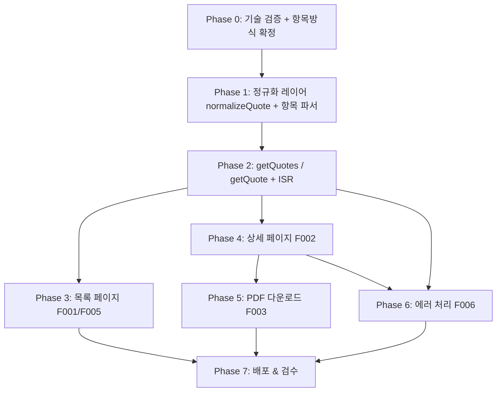

# 프로젝트 로드맵: 견적서 관리/공유 웹 애플리케이션 MVP

> 본 로드맵은 `docs/PRD.md`를 분석하여 작성되었습니다. 운영자가 노션에 입력한 견적서를
> 클라이언트가 웹에서 확인하고 PDF로 다운로드하는 MVP를 단계별로 구현하기 위한 실행 문서입니다.

---

## 개요

| 항목 | 내용 |
|------|------|
| **비전** | 견적서 공유 과정의 이메일·파일 전달 번거로움 제거 — 노션이 유일한 데이터 저장소, 웹은 읽기 전용 뷰어 |
| **핵심 목표** | (1) 노션 견적서를 웹에서 즉시 열람 (2) PDF로 오프라인 보관 (3) URL 공유만으로 전달 |
| **사용자** | 견적서 발행 1인 운영자 / 견적서 수신 클라이언트(인증 없는 공개 접근) |
| **성공 지표** | 노션 변경 60초 내 반영 · PDF 한글 정상 출력 · 404 에러 페이지 동작 · Vercel 공유 링크 접근 성공 · 견적서 URL 추측 불가(UUID) |

### 기능 ID 매핑

| ID | 기능 | 주 담당 Phase |
|----|------|--------------|
| F004 | 노션 API 연동 (`dataSources.query`) | Phase 1 → 2 |
| F001 | 견적서 목록 조회 | Phase 3 |
| F005 | 공유 링크(URL) 클립보드 복사 | Phase 3 |
| F002 | 견적서 상세 조회 | Phase 4 |
| F003 | PDF 다운로드 (`window.print()`) | Phase 5 |
| F006 | 에러 처리 (404 / API 오류) | Phase 6 |

---

## 가정 및 제약사항

- **기존 스타터킷(ch18) 기반**: Next.js 16 App Router · React 19.2 · TS strict · Tailwind v4 · shadcn/ui(radix-nova/neutral). 경로 별칭 `@/*` → `src/*`.
- **이미 설치/스캐폴딩된 자산** (재구현 금지, 채워넣기만):
  - 의존성: `@notionhq/client@^5.1.0`, `react-to-print@^3.0.5` 설치 완료
  - 데이터: `src/lib/types.ts`(`Quote`/`QuoteItem`/`quoteStatusLabel`), `src/lib/notion.ts`(`notion` 클라이언트 + `getQuotes`/`getQuote` 시그니처 stub, 본문은 미구현 `throw`)
  - 라우트: `src/app/page.tsx`(목록, `/`), `src/app/quotes/[id]/page.tsx`(상세), `src/app/error.tsx`, `src/app/not-found.tsx` — 모두 UI 골격 + TODO 주석 상태
  - 설정: `src/config/site.ts`(`siteConfig`, `mainNav`)
  - UI 프리미티브: `badge` `button` `card` `dialog` `dropdown-menu` `separator` `sonner` `table` `tooltip` 존재. 공용 위젯 `EmptyState`, `PageHeader`, `ThemeToggle`, providers 존재.
- **라우팅 사실 확인**: 목록 페이지는 `/`(루트), 상세는 `/quotes/[id]`. `mainNav`의 목록 href는 `/`.
- **React Compiler 활성화**(`reactCompiler: true`): `@tanstack/react-table`(`useReactTable`) 사용 시 컴포넌트 최상단에 `"use no memo";` 필수. **단, 본 MVP 목록/상세는 정적 카드/테이블 렌더링이므로 TanStack Table 미사용 권장** → 함정 회피.
- **RSC 기본**: 노션 fetch는 서버 컴포넌트에서. 클립보드 복사·인쇄 트리거·상태 필터 탭 등 상호작용 부분만 `"use client"`.
- **단일 소스 원칙**: 네비/메타는 `src/config/site.ts`, 프로바이더는 `src/components/providers/providers.tsx`에만 추가. 새 UI 프리미티브는 `npx shadcn@latest add`로.
- **노션 환경변수**: `NOTION_TOKEN`, `NOTION_DATA_SOURCE_ID`. data source ID는 빌드/배포 시 1회 조회해 env로 고정(ISR 페이지마다 discovery 호출 회피).
- **노션 API 2025-09-03**: `databases.query`(구형) 금지, `dataSources.query` 사용. 클라이언트에 `notionVersion: "2025-09-03"` 명시(stub에 반영됨).
- **견적 항목 저장 방식 미확정**: JSON 코드 블록(권장) vs 테이블 블록 — Phase 1에서 택1 후 파서 구현. 후행 작업(상세/PDF)의 선행 의존.

---

## 마일스톤 개요

| Phase | 목표 | 예상 규모 | 핵심 산출물 |
|-------|------|----------|------------|
| **Phase 0** | 착수 전 기술 검증 | S~M | 검증 체크리스트 통과, 항목 저장 방식 확정 |
| **Phase 1** | 노션 연동 기반 (F004) | M | `notion.ts` 정규화 레이어 + 항목 파서 완성 |
| **Phase 2** | 데이터 fetch 함수 (F004) | M | `getQuotes`/`getQuote` 실구현 + 캐시 전략 |
| **Phase 3** | 견적서 목록 페이지 (F001, F005) | M | 카드 그리드 + 상태 필터 + 링크 복사 |
| **Phase 4** | 견적서 상세 페이지 (F002) | M~L | 견적서 본문 렌더링(헤더/항목표/합계/조건) |
| **Phase 5** | PDF 다운로드 (F003) | S~M | `window.print()` + `@media print` + react-to-print |
| **Phase 6** | 에러 처리 마감 (F006) | S | not-found/error 연결 + 메시지 분기 |
| **Phase 7** | 배포 & 검수 | S~M | Vercel 배포 + 성공 기준 전수 검증 |

> 규모 표기: S(반나절) / M(1~2일) / L(3일+). 우선순위: P0(필수) / P1(중요) / P2(선택).

---

## 테스트 전략 (모든 Phase 공통 — 필수)

- **API 연동·비즈니스 로직은 "테스트 가능한 형태"로 구현**한다. 입력/출력/엣지 케이스(null·빈 값·비정상 형식·경계값)를 명확히 정의하고, 외부 의존성과 분리해 검증이 쉽도록 함수를 쪼갠다.
- **각 구현 작업에는 짝이 되는 테스트 작업을 함께 둔다.** 구현 작업의 완료 정의(DoD)에 "테스트 작성·통과"를 포함하며, **테스트 없이는 완료로 간주하지 않는다.**
- **구현 후 반드시 테스트를 수행**한다. 각 Phase 말미에 **검증 게이트**(테스트 전부 통과 시에만 다음 Phase 진행)를 둔다.
- **테스트 분류**:
  - **단위 테스트** — 순수 함수·정규화/파싱/계산 로직(`normalizeQuote`, 항목 파서, 금액 포맷터 등). 프로젝트 표준 러너(vitest 권장, 미설치 시 도입)로 작성. 외부 노션 API는 고정 표본(fixture) JSON으로 대체.
  - **E2E·UI·통합 테스트** — **Playwright MCP**(`mcp__playwright__browser_*`)로 실제 브라우저에서 수행. `browser_navigate`로 페이지 진입, `browser_snapshot`으로 렌더링 검증, `browser_click`/`browser_handle_dialog`로 인터랙션·다운로드·복사 플로우 확인.
- **테스트 환경**: 로컬 `npm run dev` 기동 후 Playwright MCP가 `http://localhost:3000`에 접속해 검증한다.

---

## 상세 단계

### Phase 0: 착수 전 기술 검증 (PRD "착수 전 기술 검증 체크리스트")

- **목표**: 본 구현을 막을 수 있는 기술 리스크를 코드 작성 전에 제거한다. 모든 항목이 통과해야 Phase 1 착수.
- **작업 목록**:
  - [x] [P0][S] **노션 v5 + dataSources.query 동작 확인** — `Notion-Version: 2025-09-03`으로 `databases.retrieve`로 data source ID 조회 후 `dataSources.query` 1건 성공시키기. 임시 스크립트 또는 `/api` route로 검증. (F004, 의존성: 없음)
  - [x] [P0][S] **한글 노션 왕복 스모크 테스트** — 한글 견적 1건 fetch → `plain_text` 한글 보존 확인. (의존성: 위 항목)
  - [x] [P0][S] **`window.print()` 한글 인쇄 미리보기 확인** — 더미 견적 화면을 인쇄 미리보기로 띄워 한글·통화(₩)·테이블 정렬 정상 표시 확인. (F003, 의존성: 없음 — 병렬 가능)
  - [x] [P0][S] **React Compiler 호환성 스모크 테스트** — `reactCompiler: true`에서 react-to-print 사용 클라이언트 컴포넌트가 빌드·런타임 정상인지 확인. 이슈 시 `"use no memo";` 적용 검토. (의존성: 위 인쇄 검증과 함께)
  - [x] [P0][S] **견적 항목 저장 방식 확정 (의사결정)** — JSON 코드 블록(권장: 1회 조회 + `JSON.parse`) vs 테이블 블록(비개발자 편집 친화, 견적 1건 ≈ 3 API 호출). 운영자가 노션 UI에서 직접 편집할지로 판단. (Phase 1 파서의 선행)
  - [x] [P1][S] **노션 DB 스키마 셋업 확인** — PRD 데이터 모델의 9개 프로퍼티(제목/견적번호/고객명/고객이메일/발행일/유효기간/합계금액/상태/메모)가 실제 노션 DB에 동일 이름·타입으로 존재하는지 확인. 프로퍼티명 ↔ 코드 매핑 키 합의.
- **리스크 & 완화책**:
  - 노션 API 버전/SDK 호환 문제 → v5 + 2025-09-03 조합 우선 검증, 실패 시 SDK 버전 핀 고정.
  - 항목 저장 방식 미확정이 후속 전부를 블록 → **Phase 0에서 반드시 확정**(가장 중요한 의사결정 게이트).
- **완료 정의(DoD)**: 6개 체크 항목 모두 통과 + 항목 저장 방식 1개로 확정 문서화.

---

### Phase 1: 노션 연동 기반 — 정규화 레이어 (F004)

- **목표**: 노션 API 응답을 앱 `Quote`/`QuoteItem` 타입으로 안전하게 변환하는 레이어를 완성한다.
- **작업 목록**:
  - [ ] [P0][M] **`normalizeQuote(page)` 구현** — `src/lib/notion.ts`. 노션 page 프로퍼티 → `Quote` 매핑. strict 모드 null 가드 필수: title/rich_text는 배열(빈 배열 가능, `plain_text` 추출 + `'제목 없음'`/`''` fallback), email/number/date/select는 미입력 시 `null`. select 값 → `QuoteStatus`(`발행→issued` 등) 매핑, 미선택 → `null`. (F004, 의존성: Phase 0)
  - [ ] [P0][M] **견적 항목 파서 구현** — Phase 0에서 확정한 방식으로 `QuoteItem[]` 파싱.
    - JSON 방식: 본문 `code` 블록 1회 조회 → `JSON.parse` → 스키마 가드.
    - 테이블 방식(택할 경우): page children → 테이블 children 2단계 조회, **헤더 텍스트 기반 동적 열 매핑**(인덱스 금지), `has_column_header` 첫 행 제외, 숫자 문자열(`"₩1,000"`) 콤마·통화기호 제거 + `NaN` 가드 파서. (의존성: 위 normalizeQuote)
  - [ ] [P1][S] **금액 계산 유틸** — `amount = quantity × unitPrice` 검산/보정, 소계/세금/합계 표시용 포맷터(`Intl.NumberFormat` ko-KR, ₩). `src/lib/utils.ts` 또는 신규 `format.ts`. 직접 구현 대신 `Intl` 사용. (의존성: 없음 — 병렬 가능)
- **테스트 & 검증** (구현 후 필수 수행):
  - [ ] [P0][S] **`normalizeQuote` 단위 테스트** — 노션 page 응답 fixture JSON으로 검증. 케이스: (a) 모든 필드 정상, (b) title 빈 배열 → `'제목 없음'`, (c) email/number/date/select `null`, (d) status 미선택 → `null`, (e) 한글 `plain_text` 보존. 외부 API 호출 없이 fixture만 사용. (vitest)
  - [ ] [P0][S] **항목 파서 단위 테스트** — 확정 방식별 케이스: JSON 방식은 정상/깨진 JSON/빈 본문, 테이블 방식은 헤더 매핑/빈 셀(`[]`)/숫자 문자열(`"₩1,000"` → `1000`)/`NaN` 가드/열 순서 변경 시나리오. (vitest)
  - [ ] [P1][S] **금액 계산 유틸 단위 테스트** — `amount = quantity × unitPrice` 검산, ₩ 포맷터 출력, 0·음수·null 경계값. (vitest)
  - [ ] **검증 게이트**: 위 단위 테스트 전부 통과해야 Phase 2 진행.
- **리스크 & 완화책**: 테이블 방식의 열 순서 변경 취약성 → 헤더 텍스트 매핑으로 방어 + 테스트로 회귀 방지. 숫자 파싱 실패 → `NaN` 가드 후 `0` fallback.
- **DoD**: 한글 견적 1건이 `Quote`(항목 포함)로 깨짐 없이 변환됨 + 위 단위 테스트 전부 통과.

---

### Phase 2: 데이터 fetch 함수 (F004)

- **목표**: 페이지가 호출할 `getQuotes`/`getQuote`를 실구현하고 ISR 캐시 전략을 적용한다.
- **작업 목록**:
  - [ ] [P0][M] **`getQuotes()` 구현** — `src/lib/notion.ts`. `dataSources.query({ data_source_id: dataSourceId, ... })` → `normalizeQuote`로 `Quote[]` 변환. 정렬(발행일 desc 권장)은 query body 또는 변환 후 처리. (F001/F004, 의존성: Phase 1)
  - [ ] [P0][M] **`getQuote(id)` 구현** — `pages.retrieve(id)` + 본문 항목 파싱 → `Quote`. 존재하지 않으면 `null` 반환(호출부 `notFound()` 처리용). (F002/F004, 의존성: Phase 1)
  - [ ] [P0][S] **ISR/캐시 전략 적용** — 목록 페이지 `revalidate = 60`, 상세 페이지 `revalidate = 300`. 필요 시 `revalidateTag` 도입 검토. (성공 기준 "60초 내 반영"의 핵심)
  - [ ] [P1][S] **429 백오프 가드** — rate limit(평균 3 req/s) 대비 가벼운 재시도 백오프. `generateStaticParams`로 다수 견적 동시 빌드 시 버스트 대비.
  - [ ] [P1][S] **env 누락 가드** — `NOTION_TOKEN`/`NOTION_DATA_SOURCE_ID` 미설정 시 명확한 에러 throw(에러 페이지로 자연 연결).
- **테스트 & 검증** (구현 후 필수 수행):
  - [ ] [P0][S] **`getQuotes`/`getQuote` 동작 테스트** — 실제(또는 테스트용) 노션 data source에 대해 호출 → `Quote[]`/`Quote` 정상 반환, 정렬(발행일 desc) 확인. (단위/통합)
  - [ ] [P0][S] **에러 분기 테스트** — 존재하지 않는 ID → `getQuote`가 `null` 반환, env 누락 → 명확한 에러 throw, 노션 429/500 응답 → 백오프·예외 전파 동작. (단위, 노션 응답 모킹/스텁)
  - [ ] [P1][S] **ISR 캐시 검증** — 노션 값 변경 후 목록 60초·상세 300초 내 반영을 **Playwright MCP**로 확인(시간차 재방문 스냅샷 비교). Phase 7 성공 기준과 연동.
  - [ ] **검증 게이트**: fetch·에러 분기 테스트 통과해야 Phase 3/4 진행.
- **리스크 & 완화책**: data source ID discovery 비용 → env 고정으로 회피(이미 설계됨). 빌드 버스트 429 → 백오프 + ISR 캐시.
- **DoD**: 두 함수가 실제 노션 데이터로 `Quote[]`/`Quote`를 반환, stub `throw` 제거됨 + fetch·에러 분기 테스트 통과.

---

### Phase 3: 견적서 목록 페이지 (F001, F005)

- **목표**: 앱 진입점(`/`)에서 견적서 카드 목록·상태 필터·링크 복사를 제공한다.
- **작업 목록**:
  - [ ] [P0][M] **목록 페이지 데이터 연결** — `src/app/page.tsx`(RSC). `getQuotes()` 호출 → 카드 그리드 렌더링. 0건이면 기존 `EmptyState` 유지. (F001, 의존성: Phase 2)
  - [ ] [P0][S] **견적서 카드 컴포넌트** — `src/components/quotes/quote-card.tsx`. `ui/card` + `ui/badge`(상태, `quoteStatusLabel` 재사용, `null`→"미분류") 사용. 표시: 견적번호·고객명·발행일·합계금액(₩ 포맷)·상태 배지. "견적서 보기" 링크(`/quotes/[id]`). (의존성: 위)
  - [ ] [P0][S] **링크 복사 버튼 (F005)** — 클라이언트 컴포넌트 `quote-share-button.tsx`. 상세 URL을 `navigator.clipboard`로 복사 → `sonner` 토스트. siteConfig.url 기반 절대 URL 생성. (F005, 의존성: 카드)
  - [ ] [P1][M] **상태 필터 탭** — 클라이언트 컴포넌트(전체/발행/승인/만료). `status === null`은 "미분류"로 처리. **TanStack Table 미사용**(단순 클라이언트 필터로 충분 → React Compiler 함정 회피). 필요 시 `ui/tabs`는 `npx shadcn@latest add tabs`로 추가. (F001, 의존성: 카드)
  - [ ] [P2][S] **로딩 상태** — `src/app/loading.tsx` 또는 카드 스켈레톤(`npx shadcn@latest add skeleton`).
- **테스트 & 검증 (Playwright MCP, 구현 후 필수 수행)**:
  - [ ] [P0][S] **목록 렌더링 E2E** — `browser_navigate`로 `/` 진입 → `browser_snapshot`으로 카드(견적번호·고객명·발행일·합계·상태 배지) 표시 확인. 0건일 때 `EmptyState` 노출 확인.
  - [ ] [P0][S] **상태 필터 E2E** — `browser_click`으로 발행/승인/만료 탭 전환 → 스냅샷으로 카드 필터링 확인. `status === null` 카드가 "미분류"로 표시되는지 확인.
  - [ ] [P0][S] **링크 복사 E2E (F005)** — 복사 버튼 `browser_click` → `sonner` 토스트 노출 확인. 클립보드 값이 상세 절대 URL인지 `browser_evaluate`로 검증.
  - [ ] **검증 게이트**: 위 E2E 전부 통과해야 다음 단계 진행.
- **리스크 & 완화책**: 필터를 TanStack Table로 구현하려는 유혹 → 단순 배열 필터로 처리해 `"use no memo"` 부담 제거.
- **DoD**: `/`에서 노션 견적서 카드가 보이고, 필터 동작, 링크 복사 시 토스트 표시 + 위 Playwright E2E 전부 통과.

---

### Phase 4: 견적서 상세 페이지 (F002)

- **목표**: 단일 견적서 전체 내용을 인쇄 품질로 렌더링한다(PDF 레이아웃의 기반).
- **작업 목록**:
  - [ ] [P0][M] **상세 페이지 데이터 연결** — `src/app/quotes/[id]/page.tsx`(RSC). `await params` → `getQuote(id)`; `null`이면 `notFound()` 호출. `revalidate = 300`. (F002, 의존성: Phase 2)
  - [ ] [P0][M] **견적서 본문 렌더링** — 회사 로고/정보(상수 또는 siteConfig), 고객 정보(이름/이메일), 견적 항목 테이블(`ui/table`: 품목/수량/단가/금액/비고), 소계·세금·합계, 발행일/유효기간/조건, 메모. (F002, 의존성: 위 + Phase 1 포맷터)
  - [ ] [P0][S] **만료 배지** — `expiresAt` < 오늘이면 "만료" 배지 표시(열람은 허용). `date-fns`로 비교. (의존성: 본문)
  - [ ] [P0][S] **뒤로가기 링크** — 목록(`/`)으로 이동하는 링크 배치.
  - [ ] [P1][S] **인쇄 친화 마크업 구조 선정** — 본문을 단일 컨테이너(`ref` 부착 대상)로 감싸 Phase 5의 `react-to-print`/`@media print`가 깔끔히 잡히도록 설계. (Phase 5 선행 정지작업)
- **테스트 & 검증 (Playwright MCP, 구현 후 필수 수행)**:
  - [ ] [P0][S] **상세 렌더링 E2E** — 유효한 견적서 URL `browser_navigate` → `browser_snapshot`으로 헤더/고객정보/항목 테이블(품목·수량·단가·금액)/소계·세금·합계/메모 표시 확인.
  - [ ] [P0][S] **만료 배지 E2E** — `expiresAt` 과거인 견적서에서 "만료" 배지 노출 + 열람 허용 확인.
  - [ ] [P0][S] **not-found E2E** — 존재하지 않는 ID로 `browser_navigate` → `not-found.tsx` 화면 노출 확인(Phase 6과 연동).
  - [ ] [P1][S] **금액 fallback E2E** — 항목 빈 배열/금액 null 견적서에서 "-" fallback·정렬 정상 확인.
  - [ ] **검증 게이트**: 위 E2E 전부 통과해야 Phase 5 진행.
- **리스크 & 완화책**: 항목 빈 배열/금액 null → fallback 표시("-"). 한글 폭 정렬 → 테이블 우측 정렬 + tabular-nums.
- **DoD**: 실제 견적서 URL에서 전체 내용이 정상 렌더링, 없는 ID는 not-found 표시 + 위 Playwright E2E 전부 통과.

---

### Phase 5: PDF 다운로드 (F003)

- **목표**: 상세 화면을 `window.print()` + `@media print` CSS로 PDF 저장(MVP 방식 1, 한글 리스크 최저).
- **작업 목록**:
  - [ ] [P0][S] **PDF 다운로드 버튼** — 클라이언트 컴포넌트 `quote-print-button.tsx`(`"use client"`). `react-to-print`의 `useReactToPrint`로 상세 본문 `ref`를 인쇄 트리거. React Compiler 이슈 시 `"use no memo";` 적용. (F003, 의존성: Phase 4 본문 ref)
  - [ ] [P0][M] **`@media print` CSS** — 전역 또는 컴포넌트 스코프. 인쇄 시 헤더/사이드바/버튼/테마토글 숨김, A4 여백, 페이지 분할(`break-inside: avoid`), 색상 보존(`print-color-adjust: exact`). 화면 Tailwind 마크업 그대로 재사용. (F003, 의존성: 위)
  - [ ] [P0][S] **한글 인쇄 검증** — 인쇄 미리보기에서 한글·₩·테이블 정렬 정상 확인(Phase 0 결과 재확인). (성공 기준 "PDF 한글 깨짐 없음")
- **테스트 & 검증 (Playwright MCP, 구현 후 필수 수행)**:
  - [ ] [P0][S] **인쇄 트리거 E2E** — 상세 페이지에서 PDF 다운로드 버튼 `browser_click` → 인쇄 다이얼로그 발생 확인(`browser_handle_dialog` 또는 `window.print` 호출 가로채기로 검증).
  - [ ] [P0][S] **인쇄 레이아웃 검증** — `browser_emulate_media`(print) 적용 상태에서 `browser_snapshot`/`browser_take_screenshot`으로 헤더·사이드바·버튼·테마토글 숨김, A4 여백, 항목 테이블 페이지 분할(`break-inside: avoid`) 확인.
  - [ ] [P0][S] **React Compiler 런타임 확인** — `reactCompiler: true` 빌드에서 `useReactToPrint` 컴포넌트가 런타임 오류 없이 동작하는지 확인(이슈 시 `"use no memo";`).
  - [ ] **검증 게이트**: 인쇄 트리거·레이아웃 테스트 통과해야 Phase 6/7 진행.
- **리스크 & 완화책**: 인쇄 다이얼로그 1단계 추가는 MVP 허용 범위. 자동/브랜딩 PDF 필요 시 방식 2(puppeteer)로 격상(Out of Scope).
- **DoD**: 버튼 클릭 → 인쇄 다이얼로그 → "PDF로 저장" 성공, 한글 정상 + 위 Playwright 검증 통과.

---

### Phase 6: 에러 처리 마감 (F006)

- **목표**: 노션 API 오류·존재하지 않는 견적서를 사용자 친화 화면으로 처리(골격은 존재, 연결·분기 마감).
- **작업 목록**:
  - [ ] [P0][S] **not-found 연결 확인** — 상세 페이지 `notFound()` → `src/app/not-found.tsx` 정상 렌더 검증. (F006, 의존성: Phase 4)
  - [ ] [P0][S] **error 경계 메시지 분기** — `src/app/error.tsx`에서 노션 API 오류/500 구분 메시지. 운영 환경 에러 로깅 TODO 처리(콘솔 → 로깅 서비스). (F006, 의존성: Phase 2 env/throw)
  - [ ] [P1][S] **에러 메시지 카피 다듬기** — 404(견적서 없음)/API 오류/500 각 케이스 한국어 문구 + "목록으로 돌아가기" 버튼 일관성.
- **테스트 & 검증 (Playwright MCP, 구현 후 필수 수행)**:
  - [ ] [P0][S] **404 E2E** — 존재하지 않는 견적서 ID `browser_navigate` → not-found 화면 + "목록으로 돌아가기" 버튼 노출 확인, 버튼 `browser_click` → `/` 복귀 확인.
  - [ ] [P0][S] **API 오류 E2E** — env 누락/노션 다운 상황 재현(테스트용 잘못된 토큰 등) → `error.tsx` 안내 메시지 노출 확인, 노션 원본 throw 메시지가 그대로 노출되지 않는지 확인.
  - [ ] **검증 게이트**: 404·API 오류 E2E 통과해야 Phase 7 진행.
- **리스크 & 완화책**: 노션 throw가 그대로 노출되지 않도록 메시지 래핑.
- **DoD**: 잘못된 ID → 404 페이지, 노션 다운/키 누락 → error 페이지가 안내 메시지로 표시 + 위 Playwright E2E 통과.

---

### Phase 7: 배포 & 검수

- **목표**: Vercel 배포 후 PRD 성공 기준을 전수 검증한다.
- **작업 목록**:
  - [ ] [P0][S] **Vercel 환경변수 설정** — 대시보드에 `NOTION_TOKEN`, `NOTION_DATA_SOURCE_ID` 등록. (의존성: Phase 2)
  - [ ] [P0][S] **프로덕션 빌드 검증** — `npm run build` + `npm run lint` 무오류, React Compiler 빌드 통과.
  - [ ] [P0][S] **전체 단위 테스트 통과** — Phase 1·2의 vitest 단위 테스트 전부 통과(회귀 확인).
  - [ ] [P0][S] **전체 E2E 회귀 (Playwright MCP)** — 배포 URL을 대상으로 Phase 3~6의 E2E 시나리오(목록·필터·복사·상세·인쇄·404/에러)를 `mcp__playwright__browser_*`로 재실행해 전수 통과 확인.
  - [ ] [P0][S] **성공 기준 전수 체크** (PRD 성공 기준, Playwright MCP로 검증):
    - [ ] 노션 변경 후 60초 내 목록 반영(ISR revalidate)
    - [ ] 상세에서 PDF 저장 성공 + 파일 열람 가능
    - [ ] PDF 한글 깨짐 없음(인쇄 미리보기)
    - [ ] 존재하지 않는 URL → not-found 표시
    - [ ] Vercel 공유 링크로 클라이언트 접근 성공
    - [ ] 견적서 URL이 노션 UUID(순차 ID 아님)인지 확인
  - [ ] [P1][S] **공유 링크 절대 URL 점검** — 배포 도메인 반영(`siteConfig.url` 또는 런타임 origin)으로 링크 복사가 프로덕션 URL을 생성하는지 확인.
- **DoD**: 배포 URL에서 성공 기준 6개 모두 통과.

---

## 의존성 그래프

- **임계 경로**: Phase 0 → 1 → 2 → 4 → 5 → 7 (상세·PDF가 핵심 가치).
- **병렬 가능**: Phase 0 인쇄/React Compiler 검증은 노션 검증과 병렬. Phase 3(목록)과 Phase 4(상세)는 Phase 2 완료 후 병렬 착수 가능.
- **핵심 게이트**: Phase 0의 "견적 항목 저장 방식 확정"이 Phase 1 파서를 블록 → 가장 먼저 결정.

---

## 미해결 질문 / 후속 확인 필요

1. **견적 항목 저장 방식** — JSON 코드 블록(권장) vs 테이블 블록 중 운영자 편집 시나리오에 맞춰 확정 필요. (Phase 0 게이트)
2. **노션 DB 프로퍼티명 일치 여부** — PRD 데이터 모델의 한글 프로퍼티명(제목/견적번호/고객명 등)이 실제 노션 DB와 정확히 일치하는지, 정규화 레이어의 매핑 키로 확정 필요.
3. **회사 로고/정보 출처** — 견적서 헤더에 표시할 발행자(회사) 정보를 어디서 가져올지(상수 / siteConfig / 노션 별도 필드). PRD에 명시 없음.
4. **세금 계산 규칙** — 합계금액은 노션 `number`(VAT 포함)로 저장되나, 상세 화면의 소계/세금 분리 표시 규칙(VAT 10% 역산 여부)이 미정. 단순히 합계만 표시할지 확인 필요.
5. **상태 select 한글 값 매핑** — 노션 select 옵션이 PRD의 "발행/검토중/승인/만료" 한글과 정확히 일치하는지(코드 `QuoteStatus` 매핑의 키). 불일치 시 매핑 테이블 보강 필요.
6. **공유 링크 비공개성** — "URL 추측 불가(UUID)"가 유일한 접근 통제. URL 유출 시 누구나 열람 가능한 점이 클라이언트 요구 보안 수준에 부합하는지 확인(MVP 범위상 인증은 Out of Scope).
